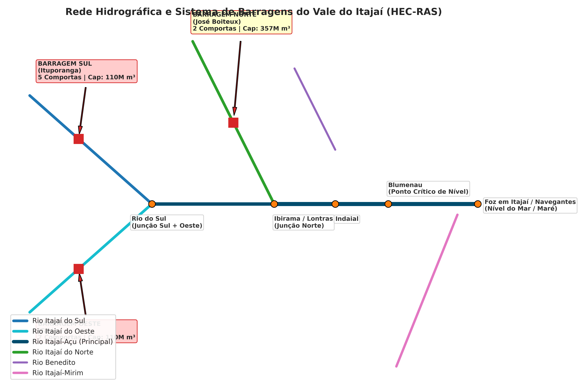
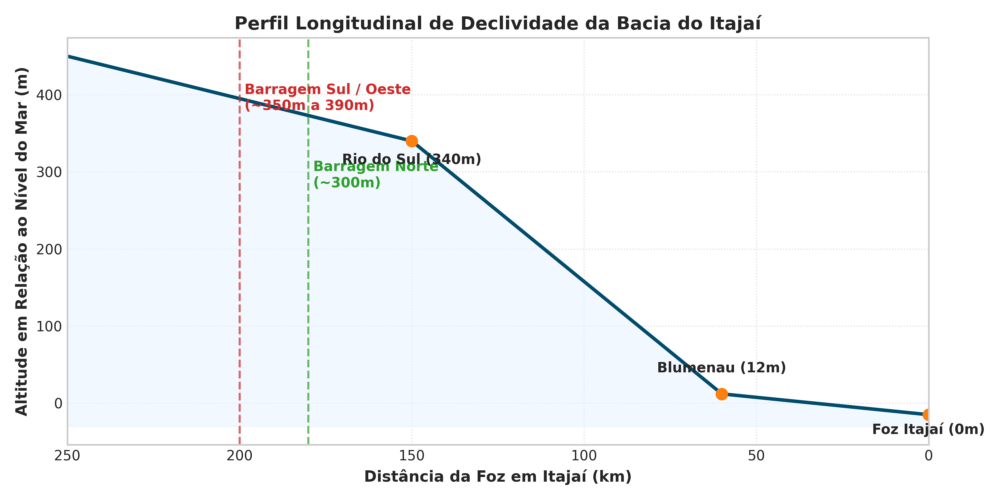
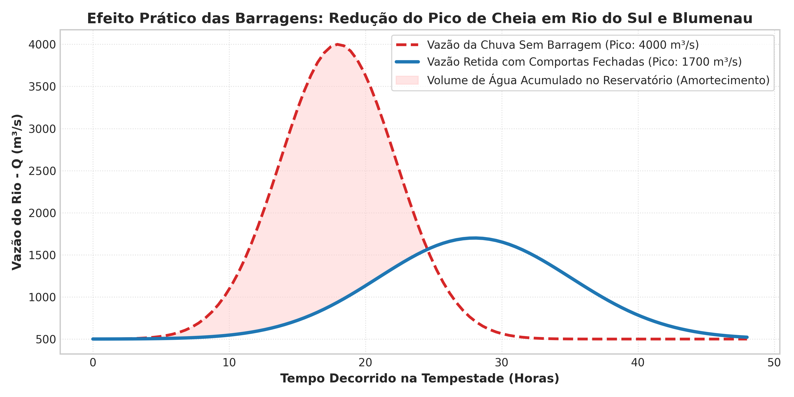

# Modelagem Hidráulica do Vale do Itajaí no HEC-RAS (com 3 Barragens)

Este repositório contém os scripts de automação em Python e a geometria hidráulica multi-trecho para a **Bacia do Rio Itajaí-Açu**, incluindo as 3 barragens de contenção de cheias da Defesa Civil de Santa Catarina.

---

## 🌊 Estrutura do Modelo

A rede hidráulica abrange os principais afluentes e junções:

- **Rio Itajaí do Sul** (com a **Barragem Sul** em Ituporanga - 5 comportas)
- **Rio Itajaí do Oeste** (com a **Barragem Oeste** em Taió - 7 comportas)
- **Rio Itajaí do Norte / Hercílio** (com a **Barragem Norte** em José Boiteux - 2 comportas)
- **Rio Itajaí-Açu** (Trecho principal passando por Rio do Sul, Indaial, Blumenau e Gaspar)
- **Rio Benedito** e **Rio Itajaí-Mirim**
- **Foz no Oceano Atlântico** (Itajaí / Navegantes)

---

## 📁 Arquivos do Projeto

- `create_full_geometry.py`: Script Python que constrói do zero a geometria multi-trecho com as 3 barragens (`Itajai_Bacia_Completa.prj` e `.g01`).
- `plot_basin_and_results.py`: Script didático que gera figuras ilustrativas sobre o comportamento hidráulico e a contenção de cheias.
- `run_hecras.py`: Controlador em Python que conecta ao HEC-RAS via COM Interface (`RAS701.HECRASController`) para rodar simulações em segundo plano.
- `fetch_full_basin_geojson.py`: Utilitário para baixar vetores da bacia via OpenStreetMap.
- `figuras/`: Pasta com os gráficos e diagramas gerados.

---

## 🎨 Figuras Didáticas Geradas

### 1. Rede Hidrográfica e Localização das Barragens


### 2. Perfil Longitudinal de Elevação da Bacia


### 3. Efeito Prático do Amortecimento pelas Barragens


---

## 🚀 Como Executar Localmente

### 1. Gerar as Figuras Didáticas
```bash
python plot_basin_and_results.py
```

### 2. Gerar o Projeto HEC-RAS da Bacia Completa
```bash
python create_full_geometry.py
```

### 3. Rodar a Simulação no HEC-RAS via Python
```bash
python run_hecras.py
```
