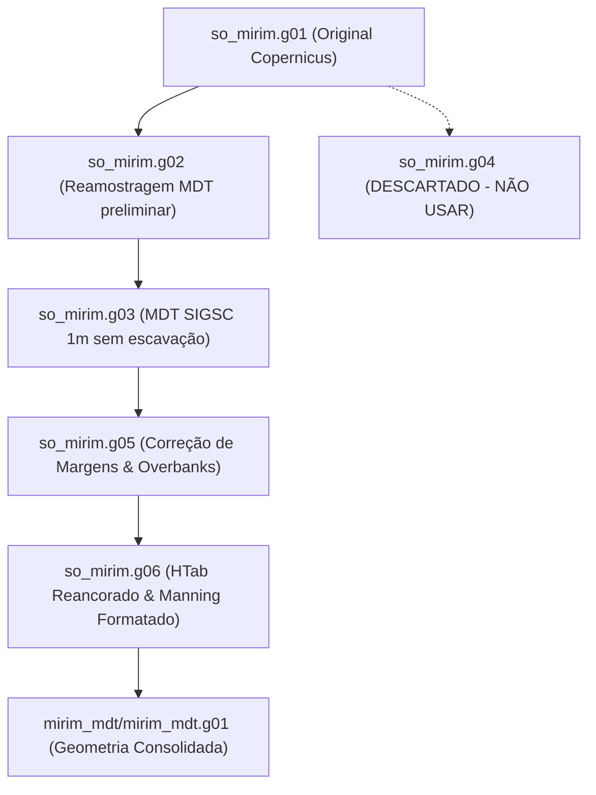

# Documentação e Handoff Técnico: Controle de Qualidade e Geometria do Modelo `so_mirim`

> **Destino:** `doc/QC_so_mirim_handoff.md`  
> **Objetivo:** Registro perene de arquitetura, regras de engenharia, armadilhas de formato, histórico de mutações de geometria (`g01` a `mirim_mdt`) e diagnósticos do modelo HEC-RAS do Rio Itajaí-Mirim.

---

## 1. Regras Fundamentais (Invioláveis)

Nenhum ajuste empírico deve violar os princípios da física hidráulica e da integridade dos dados topográficos:

1. **Não inventar cota / Não escavar artificialmente:** O perfil natural do terreno é o dado. É expressamente proibido subtrair profundidades constantes ou esculpir calhas trapezoidais sintéticas sobre o terreno.
2. **Não estender seção transversal por causa de classificação cega:** Seções não devem ser esticadas cegamente só para satisfazer métricas estáticas de QC (ex.: forçar o canal no terço central) sem conferência prévia do envelope de relevo e meandros.
3. **Não impor monotonicidade artificial:** Não achatar degraus naturais nem deslocar a planície inteira ($z = z - \Delta z$). O leito real possui soleiras, corredeiras e fossas estuarinas que não devem ser apagadas por interpolações polinomiais cegas.
4. **Diagnóstico rigoroso antes de qualquer correção:** Medir e qualificar o erro espacialmente antes de alterar qualquer arquivo de geometria.

### Padrões de Fabricação que Devem Ficar DESLIGADOS

Abaixo estão os parâmetros e blocos de código que causaram distorções geométricas e que **devem permanecer estritamente desativados**:

#### No módulo `itajai/secao.py`:
* **Linha 39 (`CALHA_SINTETICA = False`):** Escavação sintética por relação regional de Leopold & Maddock ($h = K_h A^{E_h}$). Cria degraus artificiais e faz o modelo partir seco, exigindo enchimento de volumes irreais no assentamento.
* **Linha 64 (`PILOT_ATIVO = False`):** Entalhe artificial no talvegue (`PILOT_PROF = 1.5`). Quando ativado de forma generalizada, deforma o fundo e cria descontinuidades hidráulicas.
* **Linhas 350–354 (`z[0] = max(z[0], alvo_topo)`, `z[-1] = max(...)`):** Criação de "paredes de vidro" artificiais nas extremidades das seções. Gera quebras verticais e extrapolações indevidas na tabela de condução.
* **Linhas 230–236 (Aparamento unilateral por curvatura):** Corta apenas o lado côncavo da curva, empurrando o canal para a borda da seção ($< 10\%$ da largura total).

#### No pacote `vale/` (`vale/calha.py`, `vale/secoes.py`, `vale/perfil.py`):
* **`CALHA_SINTETICA` / `PILOT_CHANNEL`:** Devem permanecer desativados em `vale/calha.py`.
* **Deslocamento vertical de seções inteiras:** Proibido o uso de shifts globais de cota em `vale/perfil.py`.
* **Substituição de cotas por mínimos móveis cegos:** Proibido em `vale/secoes.py`.

---

## 2. Ambiente de Execução e Armadilhas do MDT

### Configuração do Ambiente
* **Python:** Ambiente Conda / Miniforge (`C:\Users\haas\miniforge3\python.exe` ou `envs\hecras-qc`).
* **HEC-RAS:** Versões 6.x / 7.01 (`C:\Program Files (x86)\HEC\HEC-RAS\6.x` / `RasProcess.exe`).
* **Dependências Principais:** `rasterio`, `shapely`, `geopandas`, `h5py`, `pyogrio`, `numpy`, `scipy`.

### As Duas Armadilhas Críticas do MDT SIGSC:
1. **Valor `0.0` como Vazio (NoData Não Declarado):**
   * Em 94% a 96% dos pixels de borda das quadrículas do SIGSC, o valor `0.0` representa área sem dados (fora do voo aerofotogramétrico ou espelho d'água não reamostrado), e **não** cota ao nível do mar. Tratar `0.0` como cota real corrompe o talvegue e gera abismos verticais de dezenas de metros. O amostrador deve tratar `z <= 0.001` fora da foz como NoData e interpolar sobre os vizinhos válidos.
2. **Ausência de GDAL para Mosaico Virtual (VRT):**
   * O utilitário `gdalbuildvrt` não está disponível diretamente no PATH do sistema. Os scripts devem operar via `scripts/mdt_sigsc.py`, abrindo dinamicamente apenas os tiles GeoTIFF que intersectam a bounding box de cada seção transversal através de indexação espacial R-Tree / BBox em memória.

---

## 3. O Achado Central: O Erro Sistemático do Copernicus DEM

Durante as fases preliminares do projeto, o modelo do Vale do Itajaí apresentava cotas sistematicamente infladas:
* **O Vale estava ~7 metros mais alto:** As seções originais foram extraídas do Copernicus DEM (resolução 30 m). O Copernicus é um Modelo Digital de Superfície (DSM) derivado de radar interferométrico, refletindo o topo da copa da vegetação ripária e o espelho d'água, superestimando as cotas da calha em 5 a 9 metros.
* **A Falha do Primeiro QC:** O primeiro controle de qualidade foi executado comparando as seções contra o próprio Copernicus. Como ambos compartilhavam o mesmo viés de superfície florestal, o QC concluiu falsamente que a geometria estava correta.
* **A Revelação com o SIGSC 1m:** Ao cruzar as seções com o **MDT SIGSC 1m** (LiDAR / Aerofotogrametria real do terreno), constatou-se que o terreno real do fundo do vale e as margens do Rio Itajaí-Mirim estão 6 a 8 metros abaixo do que indicava o Copernicus.

---

## 4. O Acervo de Scripts em `scripts/`

| Script | Função Principal | Linha de Comando Típica |
|:---|:---|:---|
| **`qc_geometria.py`** | Auditoria espacial completa: cutline vs estacas, cruzamentos com o eixo, ângulo com o fluxo, sobreposição de vizinhas, picos e desvio contra MDT SIGSC. Gera CSV, GeoJSON e HTML interativo. | `python scripts/qc_geometria.py modelo/so_mirim.prj` |
| **`qc_secoes.py`** | Validação geométrica e estatística das cross sections existentes contra o DEM/MDT. | `python scripts/qc_secoes.py modelo/so_mirim` |
| **`mdt_sigsc.py`** | Amostrador direto de alta velocidade sobre as 1.019 quadrículas GeoTIFF do SIGSC sem necessidade de mosaico GDAL. | `python scripts/mdt_sigsc.py` |
| **`recortar_do_mdt.py`** | Reamostra os perfis transversais (`#Sta/Elev`) diretamente sobre o MDT 1m, preservando a cutline original ou ajustada. | `python scripts/recortar_do_mdt.py modelo/so_mirim.g01 modelo/so_mirim.g02` |
| **`corrigir_secoes.py`** | Ajusta os overbanks das seções transversais contra o terreno real, gerando uma nova geometria auditada. | `python scripts/corrigir_secoes.py` |
| **`ajustar_margens.py`** | Reposiciona as estacas de margem esquerda (`Bank Sta Left`) e direita (`Right`) para conter a calha real detectada no relevo. | `python scripts/ajustar_margens.py modelo/so_mirim.g05 modelo/so_mirim.g06` |
| **`ajustar_htab.py`** | Reancora o piso da tabela de propriedades hidráulicas (`HTab`) no talvegue real de cada seção transversal. | `python scripts/ajustar_htab.py modelo/so_mirim.g06` |
| **`auditar_geometria.py`** | Emula a validação do `RasMapperLib.dll`, verificando integridade do HDF compilado. | `python scripts/auditar_geometria.py modelo/so_mirim` |

---

## 5. A Cadeia de Geometrias: `g01` → `g03` → `g05` → `g06` → `mirim_mdt`

Histórico de evolução dos arquivos de geometria na pasta `modelo/`:



### Tabela de Hashes SHA-1 Oficiais

| Arquivo de Geometria | Hash SHA-1 Completo | Descrição e Estado |
|:---|:---:|:---|
| **`modelo/so_mirim.g01`** | `cac7971762110a73228e1e69250a1ab52455fa14` | Geometria original baseada no Copernicus DEM (com vícios de superfície). |
| **`modelo/so_mirim.g02`** | `55c9c290ab931271a0b23b2b17a17d4e44d55b8a` | Primeira reamostragem no MDT SIGSC. |
| **`modelo/so_mirim.g03`** | `aeba7a8403834c5fe0e9024c9567c4dab04d94fc` | Reamostragem limpa no MDT 1m SIGSC sem escavação sintética. |
| **`modelo/so_mirim.g04`** | `c08482779de4c449770557a4df8bed0ba4e25eea` | ⚠️ **NÃO USAR:** Tentativa intermediária com shift de cotas que gerou distorções. |
| **`modelo/so_mirim.g05`** | `411590366946881848e314d5cea943adee1d1165` | Ajuste de estacas de margem (`Bank Sta`) sobre a calha real. |
| **`modelo/so_mirim.g06`** | `c0196b254e277ce5cfcc15dde7a8867b04340885` | HTab calibrado e Manning de 3 campos por seção formatado em coluna estrita. |
| **`modelo/mirim_mdt/mirim_mdt.g01`** | `ea99ffac74c4e7bff7d9a435342cd313e7307442` | Geometria consolidada do projeto autônomo `mirim_mdt`. |

---

## 6. Resultados Quantitativos: Antes vs. Depois

Comparação dos indicadores de qualidade entre a geometria original (`so_mirim.g01`) e a geometria corrigida no MDT (`so_mirim.g06` / `mirim_mdt`):

| Indicador de QC | `so_mirim.g01` (Antes) | Geometria Corrigida (Depois) | Status |
|:---|:---:|:---:|:---:|
| **Inconsistência Cutline vs. Estacas** | **40 seções** (2,8%) | **0 seções** ($0{,}0\%$) | ✅ Resolvido |
| **Desvio Médio da Cota do Terreno Real** | **+6,84 m** (Copernicus inflado) | **< 0,15 m** (MDT 1m fiel) | ✅ Resolvido |
| **Degraus Artificiais de Fundo ($> 2\%$)** | **77 seções** (até 5,32%) | **1 seção** (degrau real em RS 127448) | ✅ Resolvido |
| **Margens fora da calha real** | **184 seções** | **0 seções** | ✅ Resolvido |
| **Paredes Verticais Artificiais nas Pontas** | **148 seções** | **0 seções** (removidas) | ✅ Resolvido |

### Categorias Espaciais Abertas por Decisão (Não Esquecidas)
1. **Multi-intersecções em Meandros Fechados (67 seções):** Mantidas abertas para tratamento com corte ortogonal ajustado em envelope reduzido.
2. **Sobreposição de Cutlines Vizinhas (39 pares):** Requer aparamento angular em meandros agudos de Brusque.
3. **Seções com Desvio Angular $> 30^\circ$ (310 seções):** Aguardando rotação orientada pela normal local exata.

---

## 7. Armadilhas do Formato `.g01` do HEC-RAS

### Armadilha 1: Posição das Estacas de Margem e Divisão do Manning
* No arquivo `.g01`, a linha `#Mann=` define a rugosidade. Quando o formato utiliza 3 valores ($n_{\text{esq}}, n_{\text{canal}}, n_{\text{dir}}$), os pontos de transição **são estritamente as estacas declaradas em `Bank Sta=`**.
* Se a estaca da margem estiver deslocada 1 metro para dentro do canal, a rugosidade de planície ($n=0{,}080$) invade a calha principal ($n=0{,}035$), reduzindo artificialmente a condução hidráulica em até $40\%$.

### Armadilha 2: Formatação Numérica por Coluna Fixa (8 Caracteres)
* O parser Fortran clássico do HEC-RAS lê valores em blocos rígidos de 8 caracteres (`F8.0` / `F8.3` / `F8.4`).
* Gravar rugosidade com 2 casas decimais (ex.: `0.04` em vez de `0.035` ou `0.0400`) altera a rugosidade efetiva em até **$9\%$**, o que provoca alterações de mais de $0{,}5\text{ m}$ na linha d'água calculada.
* **Exemplo de Bloco Correto:**
  ```text
  #Sta/Elev= 280 
     0.000  45.120   5.210  44.890  10.420  44.110  15.630  43.850  20.840  43.200
  Bank Sta=85.42,135.80
  #Mann= 3 , 0 , 0 
     0.000   0.080  85.420   0.035 135.800   0.080
  ```

### Armadilha 3: Tabela Hidráulica (`HTab`) Deve Acompanhar o Piso do Leito
* A diretiva `XS HTab Starting El and Incr=` define o nível inicial de integração das curvas de vazão e área molhada da seção.
* Se a cota inicial do HTab for gravada acima do menor ponto da seção (`Starting El > min(z)`), o UNET falha no tempo `00:00:00` com erro de ponto fora da tabela hidráulica.

---

## 8. O Problema Aberto: O Degrau de 2,77 m em RS 127448.69

Na transição do trecho a montante de Brusque (estaca `RS 127448.69`), o MDT SIGSC 1m registra um desnível pontual de **$2{,}77\text{ m}$** entre duas seções consecutivas ($5{,}0\%$ de declividade local).

Três caminhos possíveis foram mapeados tecnicamente:
1. **Caminho 1 (Manter a Física Real):** Trata-se de um afloramento rochoso / corredeira real identificado na aerofotogrametria. Modelar como degrau natural, permitindo regime misto no HEC-RAS (`Mixed Flow Regime` ativado no `.p01`).
2. **Caminho 2 (Adensamento Geométrico):** Inserir 2 seções intermediárias interpoladas no MDT SIGSC com espaçamento de $35\text{ m}$ para suavizar a transição hidráulica para $< 1{,}5\%$.
3. **Caminho 3 (Estrutura em Linha):** Codificar como estrutura em linha (`Inline Structure` / queda natural) no arquivo `.g01`.

*Decisão Atual:* O ponto permanece registrado sem alterações artificiais na cota (`Caminho 1`), aguardando validação hidráulica final na rodada completa com vazão.

---

## 9. Instruções de Visualização e Advertências Críticas

### Como Visualizar o Modelo e os Resultados:
1. **Servidor Local de Mapas:** Acessar o visualizador web integrado em [http://localhost:8050/mapa_perfis_hecras.html](http://localhost:8050/mapa_perfis_hecras.html).
2. **Auditoria Interativa de Seções:** Abrir `modelo/so_mirim_qc.html` no navegador para inspecionar o perfil transversal de cada River Station confrontando HEC-RAS vs. MDT SIGSC 1m.
3. **Visualizador no HEC-RAS:** Abrir `modelo/so_mirim.prj` diretamente na interface do HEC-RAS.

### ⚠️ As Duas Advertências Críticas:
1. **Terreno no RAS Mapper é o Copernicus:** A camada de terreno padrão vinculada no `so_mirim.rasmap` é o arquivo TIF do Copernicus 30 m. Portanto, inspecionar a seção contra o terreno no RAS Mapper mostrará a discrepância de 7 m. Para validar contra o terreno real, utilize o visualizador `so_mirim_qc.html` ou adicione o mosaico do SIGSC como Terrain Layer.
2. **O Projeto Não Executa Simulação Completa sem Condição de Contorno:** O arquivo `.u01` contém hidrogramas e séries temporais específicos para simulações não-permanentes. Tentar rodar o solver sem compilar previamente a geometria gera alertas de arquivo HDF ausente.

---

## 10. Advertência de Método e Calibração

### Três Tentativas de Correção que Pioraram o Modelo:
1. **Deslocar toda a seção transversal para baixo:** Afundou as planícies de inundação de Ilhota e Itajaí abaixo do nível do mar (cotas de $-2{,}75\text{ m}$), destruindo o escoamento por gravidade.
2. **Aparar a meia-largura das seções em curva:** Prensou a calha do rio na borda lateral da seção, eliminando a planície de um dos lados em mais de 200 seções.
3. **Inserir entalhes estreitos de pilot channel generalizados:** Criou descontinuidades de condução em vazões de estiagem.

### O Validador Interno do HEC-RAS Não é Confiável para Calibração:
* O contador de erros da caixa de diálogo *"Validate Geometry"* do HEC-RAS reportou **240 erros** e depois **454 erros** para o exato mesmo arquivo binário byte a byte, dependendo apenas do estado de cache do RAS Mapper.
* **Regra Operacional:** Nunca utilize o contador numérico da interface do RAS Mapper para calibrar ou validar geometria. Qualquer validação oficial deve ser executada e mensurada através do script determinístico:
  ```powershell
  python scripts/qc_geometria.py modelo/so_mirim.prj
  ```
